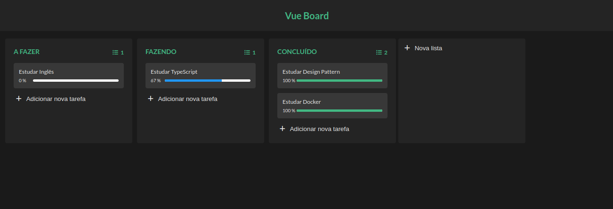

# Vue Board

VueBoard é uma aplicação web inspirada no Trello que permite organizar tarefas e informações em boards com cards que podem ser facilmente arrastados e soltos. É construído com Vue.js para uma experiência de usuário suave e interativa.



Confira em produção: https://vue-board.vercel.app

## Recursos Principais

- **Arraste e Solte**: Mova seus cards entre colunas com facilidade, reorganizando suas tarefas da maneira que desejar.

- **Detalhes Personalizáveis**: Adicione descrições e rótulos aos seus cards.

## Como Usar

1. Clone o repositório
```sh
git clone https://github.com/Ricardofreitasdev/Vue-board.git
```

2. Entre na pasta do projeto
```sh
cd Vue-board
```

3. Instale as dependencias 
```sh
yarn install
```

4. Execute a aplicação 
```sh
yarn start
```
